## Docsify setup with podman  ##

**Requirement of docsify setup:**

Docsify is a lightweight, flexible, and easy-to-set-up documentation generator that can turn your Markdown documentation into a website.

- Distributor ID: Ubuntu <br>
- Description: Ubuntu 20.04.6 LTS <br>
- Release: 20.04 <br>
- Codename: focal<br>

## Prerequisites Tools
 
 - Podman 

## Podman

- Podman is a tool that helps you run and manage software packages called containers on your computer.
 
<br>  
Now start a setup by following these steps:
<br>

## Step 1: Update Your System

First update and upgrade by using this command :
```
sudo apt update 
```
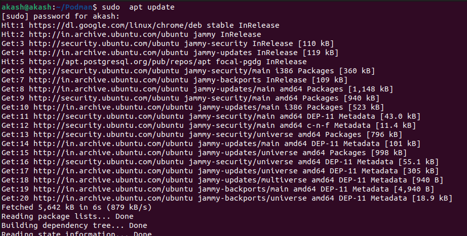

```
sudo apt upgrade
  ```

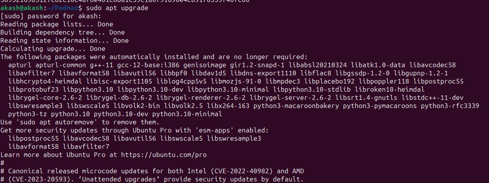

Then use podman installation command:


## Step 2: Install Podman

```
sudo apt  install -y podman
```
- sudo : Superuser do

- apt : This stands for "Advanced Package Tool. apt is used to install, update, and manage software packages on your sysytem.

- -y : Automatically confirms the installation without asking for user input.

- podman : It is the name of the package you want to install.


## Step 3: Check Podman Version

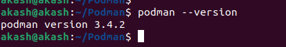

## Step 4: Create a Directory
```
mkdir Podman
```

- mkdir : This command use for making a new directory
- docs : Name of new directory.

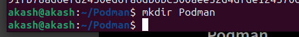

## Step-5:- Create Dockerfile

Add details in Dockerfile:
```
sudo apt install vim

```
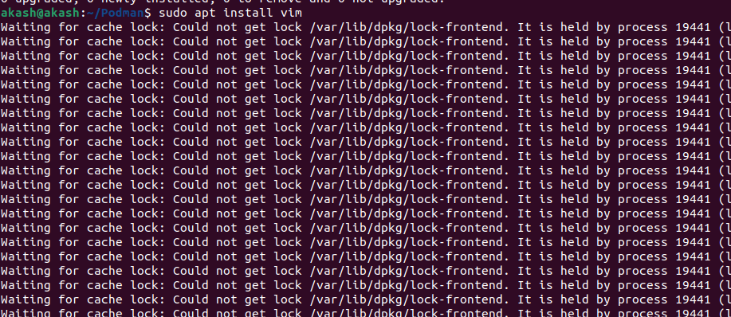

```
vim Dockerfile
```


- vim : Use for create and edit a file.

- Dockerfile : Name of file.

Add details in Dockerfile:

please insert button and than


```    
FROM node:latest
LABEL description="A demo Dockerfile for build Docsify."
WORKDIR /docs
RUN npm install -g docsify-cli@latest
EXPOSE 3000/tcp
ENTRYPOINT docsify serve .
  ```

save this file
1) esc
2) :
3) wq
4) enter button


## Step-6:-Create index.html


please insert button and than


```  
vim index.html
```

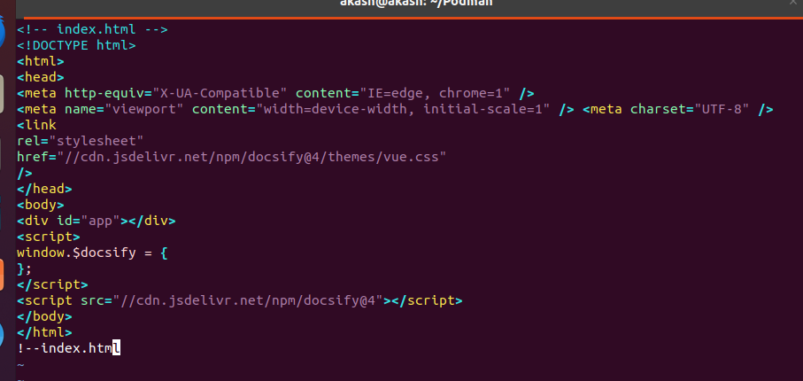

save this file
1) esc
2) :
3) wq
4) enter button


Add details in html file:

## Step-7:- Create new file in md format

```  
touch README.md
```

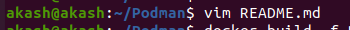

- touch : Use for creating new file.
  
Here we can check all files by using this command:

- ls : It is a Linux shell command that lists directory contents of files and directories.


## Step-8:- Build docker image

```
sudo apt  install docker.io
```


```
 podman build -f Dockerfile -t docsify/demo .
 ```

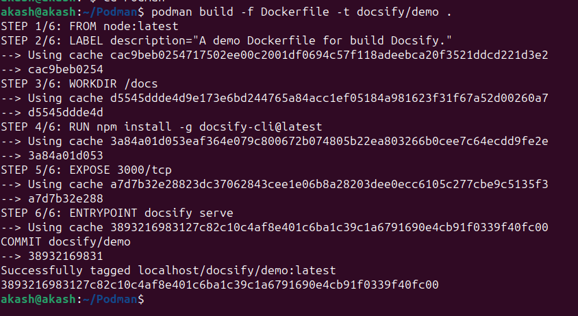

- podman build : Initiating the container image building process means starting the procedure to create a new container image.

- -f : It stands for file.

- Dockerfile : It specifies the name of the Dockerfile that should be used for the container image build.

- -t : It stands for tag.

- docsify : This is the name for the image.

- / : It uses for path separator in file and directory path.

- demo : This is the tag for the image.

This command is used to manage container images in Podman.

## Step-9:-Run podman

Create a podman container for docsify.

```
 podman run -itp 3000:3000 --name=podman -v /home/akash/podman:/docs localhost/docsify/demo
```

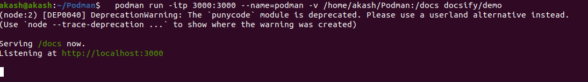

- podman run: This part of the command instructs Podman to run a container.
- -itp 3000:3000: This part of the command specifies options for the container. Let’s  break it down:
- -i: It stands for interactive mode, which allows you to interact with the container's shell or command prompt.
- -t: It allocates a pseudo-TTY, which is often used in combination with the interactive mode for a better terminal experience.
- -p 3000:3000: This part specifies port mapping. It means that the container's port 3000 is mapped to the host's port 3000. So, if the container is running a service on port 3000, you can access it from your host machine at http://localhost:3000.
- --name=podman: This part assigns a name to the container, in this case, "podman." This makes it easier to reference and manage the container.
- -v: /home/akash/Podman:/docs: This part sets up a volume. It tells Podman to mount the directory at /home/akash/Podman on your host machine into the container at the path /docs. This is useful for sharing files or data between the host and the container.
- docsify/demo: This is the name of the container image you want to run. In this case, it's "docsify/demo," which is the image you want to create a container from. It typically contains the software or application you want to run in the container.

This command is used to see all containers on your system, both running and stopped.


```  
podman ps -a
```
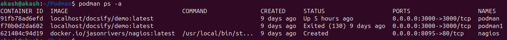

```  
podman ps
```
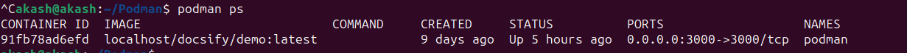


## Step-10:- Fill Output

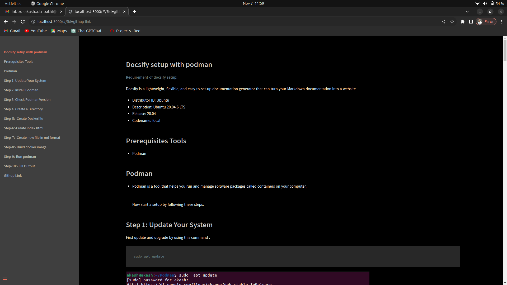


##  Githup Link 


https://github.com/akash9458/Docsify-setup.git